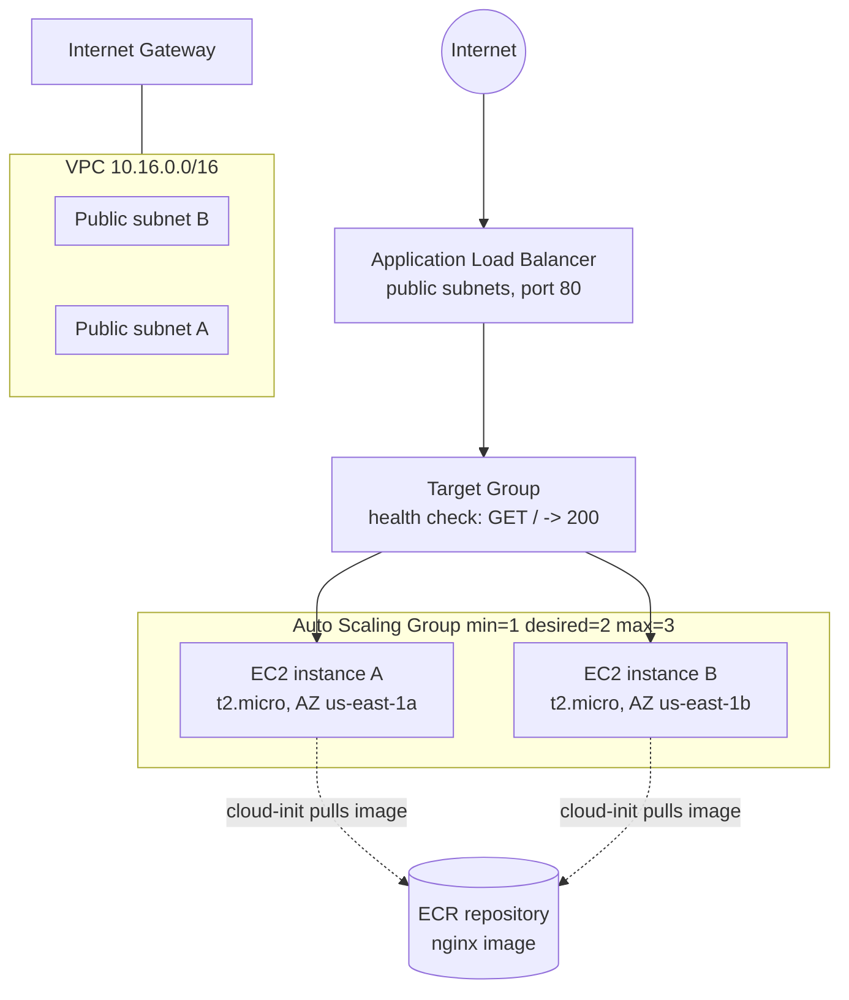

# Simple_auto_healing_infrastructure_in_aws_using_Tf
Auto-healing, containerised NGINX web tier on AWS — Terraform-provisioned ASG + ALB, instances bootstrap via user-data to pull and run a Docker image.

# Auto-Healing Web Tier (AWS, Terraform)

A self-healing, N+1 NGINX web tier on AWS: an Application Load Balancer in
front of an Auto Scaling Group running a containerised NGINX page. Terminate
any single instance and the ASG replaces it automatically, with zero manual
steps and zero downtime for the other instance(s).

## Why AWS over Azure

AWS was chosen because the required primitives map onto services with the
cleanest managed "just works" behavior for this specific brief:

- **Auto Scaling Group + ALB target-group health checks** give self-healing
  and N+1 out of the box with no extra glue (no Function App / Logic App
  needed, unlike replicating this on Azure VMSS + health extensions).
- **SSM Parameter Store `resolve:` syntax** lets the launch template always
  boot the latest Amazon Linux 2023 AMI without a lookup `data` block or a
  hardcoded, quickly-stale AMI ID.
- Personal familiarity with the AWS provider meant less time debugging
  provider quirks and more time on the actual architecture - a reasonable
  and disclosed reason for either cloud in a take-home like this.

Either AWS (ASG+ALB) or Azure (VMSS+Load Balancer/App Gateway) would satisfy
the brief equally well; this is a preference, not a claim that AWS is
objectively superior for this use case.

## Architecture



**Self-healing loop:** the ALB target group health-checks each instance on
`GET /`. If an instance is terminated (or fails health checks), the ASG's
`health_check_type = "ELB"` setting detects it, launches a replacement from
the launch template in the same subnet pool, and the target group picks it
up automatically once it passes health checks — no human involved.

## Prerequisites

1. Terraform >= 1.9, AWS CLI configured with credentials that can create
   VPC/EC2/ALB/IAM/ASG resources.
2. An S3 bucket for remote state must already exist (S3 backends don't
   create their own bucket): the bucket named in `backend.tf`
   (`remote-backend-for-terraform-statefile-practice-2026`) in `us-east-1`,
   or edit `backend.tf` to point at your own / switch to a local backend
   for a quick first run:
   ```
   terraform init -backend=false
   ```
3. An ECR repository containing the built image (see **Containerisation**
   below), or override `image_name`/`image_tag`/`ecr_account_id` in
   `terraform.tfvars` to point at your own registry image.

## Run it

```bash
terraform init
terraform validate
terraform plan
terraform apply          # type 'yes' to confirm
```

Re-running `terraform plan` / `terraform apply` immediately after a clean
apply should show **no changes** — everything here is declarative with no
`count`/index-based resources that drift on re-run.

```bash
terraform output url     # -> http://<alb-dns-name>
```

Tear down:

```bash
terraform destroy
```

(`enable_alb_deletion_protection` defaults to `false` specifically so
`destroy` doesn't require a manual console step first — flip it to `true`
for anything long-lived.)

## Testing self-healing

```bash
# find a running instance ID from the ASG
aws autoscaling describe-auto-scaling-groups \
  --auto-scaling-group-names "$(terraform output -raw asg_name)" \
  --query 'AutoScalingGroups[0].Instances[].InstanceId' --output text

# terminate one
aws ec2 terminate-instances --instance-ids <instance-id>

# watch the ASG bring up a replacement - the OTHER instance keeps
# serving traffic the whole time, so the ALB URL stays up
watch aws autoscaling describe-auto-scaling-groups \
  --auto-scaling-group-names "$(terraform output -raw asg_name)"
```

## Containerisation (bonus)

- `dockerfile` — `nginx:alpine` + the static `index.html`.
- Build & push to ECR (or swap for GHCR/Docker Hub and adjust the
  `image_*` variables and the pull step in
  `modules/launch_template/templates/user_data.sh.tpl` accordingly):
  ```bash
  aws ecr create-repository --repository-name my-nginx-app --region us-east-1
  aws ecr get-login-password --region us-east-1 | \
    docker login --username AWS --password-stdin <account-id>.dkr.ecr.us-east-1.amazonaws.com
  docker build -t my-nginx-app .
  docker tag my-nginx-app:latest <account-id>.dkr.ecr.us-east-1.amazonaws.com/my-nginx-app:latest
  docker push <account-id>.dkr.ecr.us-east-1.amazonaws.com/my-nginx-app:latest
  ```
- Each instance's `user_data` (rendered from the template above at launch)
  authenticates to ECR using its instance IAM role
  (`AmazonEC2ContainerRegistryReadOnly` — read-only, least privilege),
  pulls the image, and runs it with `--restart always`.

## Assumptions

- Single region (`us-east-1`), two public subnets across two AZs — no NAT
  gateway / private subnets, since this is a stateless static web tier and
  a NAT gateway alone would blow the cost budget below.
- State is stored remotely in S3 with native S3 locking (`use_lockfile`,
  Terraform >= 1.10 pattern) instead of a DynamoDB lock table.
- `key_pair_name` defaults to `"terraform-key"` — create that key pair (or
  override the variable) before applying if you need SSH access; it isn't
  required for the app to function.
- No HTTPS/ACM certificate — port 80 only, to keep the demo self-contained.
  Add an `aws_acm_certificate` + a 443 listener for anything real.

## Estimated monthly cost (if left running continuously)

| Resource | Estimate (USD/mo) |
|---|---|
| 2× t2.micro (desired capacity) | ~$17 (or ~$0 if AWS Free Tier–eligible account, 750 hrs/mo for 12 months) |
| Application Load Balancer (fixed hourly charge) | ~$16–18 |
| ALB LCU usage (near-zero demo traffic) | ~$1–2 |
| 2× 20 GB gp3 EBS | ~$3 |
| **Total** | **~$37/mo (~AUD 55–60) continuously, or ~$20/mo (~AUD 30) on Free Tier** |

**This exceeds the AUD 20 target if left running 24/7** — the ALB's fixed
hourly charge (no free tier) is the dominant cost, not the EC2 instances.
To stay within budget: `terraform apply` for the grading/demo window, then
`terraform destroy` immediately after. Realistically there's no way to keep
an always-on ALB + 2 instances under AUD 20/month; that's a genuine
trade-off of the "N+1 behind a load balancer" requirement versus a single
low-cost instance, and it's worth flagging explicitly rather than quoting
an unrealistic figure.

## Known limitations / follow-ups

- No HTTPS.
- No CI pipeline yet building/pushing the image or running
  `terraform validate`/`plan` on PRs (optional in the brief, not yet
  implemented here).
- No CloudWatch alarms/SNS notifications — self-healing relies solely on
  native ASG + ELB health checks, which is sufficient for the stated
  requirement but wouldn't page anyone.
